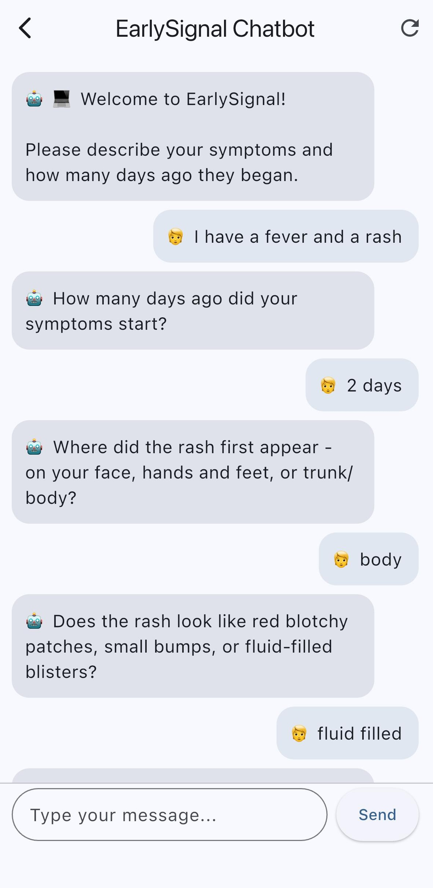
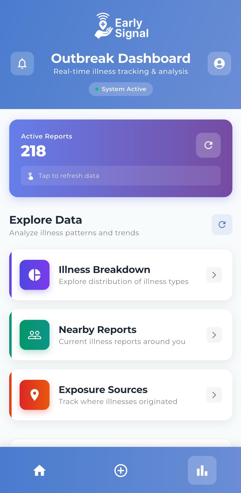

# EarlySignal: Democratizing public health through real-time community alerts

  

EarlySignal is an AI-powered mobile platform that detects emerging outbreaks by combining frontier-model diagnostic reasoning with geospatial analytics and clustering. The system collects anonymous symptoms, interprets them through a structured LLM agent, and then maps each report in both space and time using census-tract boundaries and temporal windows. By aggregating cases using clustering and comparing individual diagnoses to patterns around them, EarlySignal creates a collective medical intelligence layer that strengthens diagnostic confidence and highlights localized anomalies long before traditional surveillance systems surface them.

---

## 🛜 Table of Contents

1. [Project Motivation](#1--project-motivation)
2. [Overview of EarlySignal](#2--overview-of-earlysignal)
3. [Project](#3--project)
   - [EarlySignal Agent — Personal Health Intake and Guidance](#31--earlysignal-agent--personal-health-intake-and-guidance)
    - [Cluster Validation Agent - Collective Intelligence Layer](#311--cluster-validation-agent--collective-intelligence-layer)
   - [Alert System — Detecting Emerging Outbreaks](#32--alert-system--detecting-emerging-outbreaks)
   - [Dashboards — Seeing the Signal](#33--dashboards--seeing-the-signal)
   - [Architecture Overview](#34--architecture-overview)
4. [Evaluation & Metrics](#4-evaluation-metrics)
5. [Market Fit and Potential](#5--market-fit-and-potential)
6. [Future Works](#5--future-works)
7. [Tools Used](#6-️-tools-used)
8. [The Team Behind the App](#7--the-team-behind-the-app)

---

## 1. 🛜 Project Motivation

*Outbreaks don't start with headlines, and even experts struggling to see what's emerging before it's widespread.*

Public health signals rarely appear first in official data. By the time headlines announce a measles spike, a contaminated restaurant, or a new respiratory variant, exposure has already spread through communities. Reporting pipelines are slow, delayed, and aggregated at coarse geographic levels that hide granular neighborhood-level patterns. On top of that, in the early stages of illness, symptoms often overlap so heavily across diseases that even clinicians struggle to distinguish them without lab tests, and struggling to detect outbreaks before they're widespread.

*EarlySignal was built to bridge these gaps.*

Imagine Priya, whose child wakes up with a rash and fever, or Alex, an immunocompromised student trying to avoid respiratory outbreaks on campus. Both need timely, localized insight that goes beyond county dashboards and anecdotal guesses to protect themselves, their family, and their community. EarlySignal gives them a way to understand what’s emerging in their immediate surroundings, drawing on real-time community reports and AI-supported guidance to make informed decisions days or weeks or even months before public alerts catch up.

---

## 2. 🛜 Overview of EarlySignal

EarlySignal is organized around three core systems that work together end-to-end:

  

1. **EarlySignal Agent**
The chatbot collects symptoms, timing, and location information through a structured LLM pipeline built using Langgraph agent orchestration. During this process, a cluster-validation agent, built around the ensemble modelling framework, compares each new report with nearby cluster of cases and refines the diagnosis when strong neighborhood-level patterns appear. This is what allows the system to improve its accuracy as participation grows.

2. **Alert Engine**
All reports are mapped to census tracts and analyzed for spatial and temporal clustering. The alert engine detects anomalous concentrations of illness, identifies exposure-based clusters using DBSCAN, and evaluates whether conditions meet predefined thresholds for issuing localized alerts.

3. **Dashboards**
The aggregated data feeds into dashboards that show illness activity across tracts, cluster locations, illness category breakdowns, and recent illness trends. These dashboards give communities continuous visibility into what is circulating around them and how patterns are evolving and allows for customizable views of illness activity around them.

Together, these components turn individual reports into a real-time community health signal.

---

## 3. 🛜 Project

### 3.1 🩵 EarlySignal Agent — Personal Health Intake and Guidance

At the center of EarlySignal is a conversational agent built on *LangGraph*, a framework for structuring multi-step AI dialogues. The chatbot is powered by *Google’s Gemini 2.0 Flash* LLM model, which enables fast, contextual understanding of user symptoms and conversational health guidance.

When a user opens the app, the chatbot:

1. Collects key symptoms and their onset time in natural language.  
2. Generates a preliminary diagnosis with a confidence estimate.  
3. Asks follow-up questions about exposure location (where the illness may have been caught) and current location (where the user is now).  
4. Offers care recommendations and guidance on when to seek medical help.

  
  
  
   
  
  

**NOTE: REPLACE WITH DEMO OF CHAT**

Each interaction contributes an anonymized record including symptoms, diagnosis, and geolocation to a secure data store. As more users participate, the system gains “collective wisdom,” i.e., when multiple nearby users report similar patterns, the model refines its diagnostic confidence and improves local accuracy.

We fed the diagnostic agent curated knowledge of the most common infectious diseases that typically cause community outbreaks, in the form of a standardized disease list and their associated symptoms. For rare or non-infectious conditions, the LLM draws on its own internal medical knowledge base to infer likely causes based on context.

**Conversation orchestration** uses *LangGraph* with explicit state and validators:  
- State sections include user interaction, history, symptoms, diagnosis, exposure tracking, current location, final outputs, and control flags
- Validators ensure symptoms, locations, and timing inputs are sensible before advancing

**Node sequence**  
symptom_collection → extract structured symptoms + onset days  
diagnosis → LLM proposes diagnosis; may ask up to three clarifying questions  
exposure_collection → extract where and when exposure happened  
location_collection → collect current city/state then venue or landmark  
bq_submission → package and write report to *BigQuery*  
care_advice → return tailored advice and “when to seek professional medical help”

**Routing rules (conditional edges)**  
Nodes only proceed when required fields are valid; otherwise, the system pauses and waits for user input.  
Final edges (bq_submission → care_advice → END) are unconditional.

**Confidence refinement via “collective wisdom”**  
This component is inspired by the principles of *ensemble modeling*, where multiple independent inputs are combined to produce a stronger, more reliable prediction.  
EarlySignal applies this idea by aggregating diagnoses and symptom reports across users within shared spatial and temporal windows. If multiple nearby reports exhibit similar diagnostic outcomes, the system dynamically increases the confidence score for that condition (e.g., from 60% to 80–90%), treating community consensus as a reinforcing signal rather than relying on a single agent output.

This approach merges personalized AI care with community-level insight, bridging private experience and public health awareness.

---

### 3.1.1 🩵 Cluster Validation Agent - Collective Intelligence Layer

----

### 3.2 🩵 Alert System — Detecting Emerging Outbreaks

  

Every report from the chatbot feeds into a unified analytical pipeline hosted in *BigQuery*. The alert system identifies patterns of illness activity across neighborhoods and within localized clusters, combining both into one cohesive feed.

**1. Every report becomes a data point**  
When a user submits symptoms through the chatbot, the app logs their approximate location and diagnosis in a secure dataset.

**2. Neighborhood mapping (Tract-Assigment)**  
Each report is linked to a census tract — a small geographic area of roughly 1,200–8,000 people that serves as the neighborhood unit.

**3. Hotspot detection (Cluster-Based Alerts)**  
The system identifies groups of reports that occur close together in both space and time using a *DBSCAN (Density-Based Spatial Clustering of Applications with Noise)* algorithm. This unsupervised clustering method helps detect areas of concentrated illness activity by grouping reports and creating clusters with a minimum of 3 data points.  
- For respiratory illnesses, clusters are detected within roughly *500 meters*  
- For other diseases, clusters can span up to *5 miles( to capture shared exposure sites such as restaurants, events, or pools

**4. ⁠⁠Baselines are computed within each cluster**  
Once clusters are detected, the system evaluates how current case counts compare to historical baselines for that cluster.  
This step ensures that alerts are not triggered by isolated or routine fluctuations but by genuine anomalies in disease activity.

**5. Localized alerts in the app**  
When outbreak thresholds are met, alerts are automatically issued to users whose assigned tracts overlap or are adjacent to the affected clusters.  
An alert is generated when:  
- More than *60%* of reports within a tract are diagnosed as the same disease, and 
- At least *three similar reports* are found within a single DBSCAN cluster.  

Users currently located within or near the impacted tract receive a push alert and can view the affected area directly on the in-app map. This design connects individual reports, local neighborhood trends, and cluster detection into a layered early-warning system, ensuring that community alerts are both targeted and timely.

---

### 3.3 🩵 Dashboards — Seeing the Signal

  

**NOTE: DEMO OF DASHBOARD SHOWING FUNCTIONALITY TO BE ADDED**

The app’s dashboard transforms community data into clear, actionable visuals:  

- **Heatmaps** highlight current and historical illness concentrations 
- **Pie and trend charts** show disease distribution by category
- **Filters** allow users to explore by radius, exposure type, or timeframe

Dashboards are generated dynamically from *BigQuery* through *Firebase Cloud Functions* locally in Flutter, ensuring real-time accuracy while keeping user data private and authenticated.

These interfaces translate raw analytics into intuitive public insight — allowing citizens to “see” the health of their surroundings.

---

### 3.4. 🩵 Architecture Overview

The EarlySignal system integrates the mobile app, authentication layer, LLM chatbot workflow, and alert engine through a coordinated flow across **Flutter**, **Firebase**, **FastAPI**, and **BigQuery**. Below is a high-level overview of how data moves through the platform.***

  

*I User Authentication & App Initialization*

1. The user opens the EarlySignal mobile app (built in Flutter) and attempts to log in.
2. The app requests an authentication token from Firebase.
3. Firebase verifies the token and grants secure access to the rest of the system.

*II Location Collection, BigQuery Storage & Alert Logic*

4. The app collects the user’s current GPS-enabled location geopoint.
5. This location data is sent securely to Firebase.
6. Firebase Cloud Functions pass the GPS data to BigQuery to support home page dashboard rendering and alert targeting.
7. When alerts are available, Firebase Cloud Functions fetch them from BigQuery and return them to the front end.

*III EarlySignal Chatbot Interaction*

8. The user begins a chat session with the diagnostic agent.
9., 10. The FastAPI backend manages the full LLM workflow, including iterative symptom extraction, clarification questions, exposure information, and final diagnosis generation, along with receiving GPS-enabled location geopoint. 
11. Once the conversation is complete, the final structured report is submitted to BigQuery through FastAPI.

*IV Dashboard Updates*

12. Firebase receives the newly submitted reports from BigQuery.
13. Dashboard views update on the front end as new reports and clusters become available.

---

## 4. 🛜 Evaluation Metrics 

EarlySignal was evaluated through *qualitative guardrails* and *quantitative testing*.

**Qualitative Validation**

| **Component** | **Description** |
|:--|:--|
| *Curated disease list* | 30+ standardized outbreak diseases across 5 transmission categories with exact naming conventions |
| *Differential diagnosis logic* | Symptom-based decision logic (e.g., fever + rash → assess rash location/distribution |
| *Uncertainty handling* | Returns “Unknown” when confidence is insufficient instead of forcing a label |
| *Spatial-temporal checks* | Diagnoses cross-referenced against active outbreak clusters in BigQuery |

**Quantitative Validation**

Synthetic outbreaks were generated across illness categories to measure accuracy on core tasks.

| **Task** | **Description** | **Accuracy** |
|:--|:--|:--|
| *Illness category classification* | Assigning the correct illness category from symptoms and clarifiers | **90%** |
| *Exposure location geocoding* | Parsing natural-language exposure descriptions into coordinates | **88%** |
| *Outbreak cluster detection* | Identifying matching spatial-temporal clusters | **95%** |
| *Outbreak cluster validation* | Confirming or revising diagnoses using nearby cluster context | **85%** |

---

## 5. 🛜 Market Fit and Potential

Traditional public health reporting is largely reactive, with data often released weekly or even biweekly.  
EarlySignal shifts this paradigm toward community-rooted, real-time detection.  

By combining peer-to-peer symptom reporting with AI-driven spatial clustering, the system surfaces emerging health signals at a fraction of the time and cost of centralized infrastructures.  

**Quantitative Comparison**

| **Metric** | **Traditional Systems (E.g. CDC,NIH)** | **EarlySignal** | **Improvement** |
|:--|:--|:--|:--|
| *Average time from symptom onset to detection* | 7–10 days | 1 day | ~85% faster |
| *Cost per case processed* | \$10–\$15 (staff + systems) | < \$0.10 (cloud compute) | ~99% cheaper |
| *Geographic precision* | County/City/State level | Census tract level | 10× finer |
| *Frequency of updates* | Weekly | Continuous | Real-time |

Even a few days of earlier awareness can translate to significant economic and health impact by reducing outbreak costs, preventing secondary cases, and enabling faster local action.

**Use Cases**

- Universities and schools monitoring campus health trends 
- Local health departments supplementing official surveillance
- NGOs or emergency teams deploying in disaster zones
- Communities tracking seasonal illnesses or post-event exposures

Comparable initiatives such as *HealthMap* and *Flu Near You* have demonstrated the power of participatory surveillance. EarlySignal builds upon these successes with AI-assisted triage, tract-level precision, and continuous data flows — offering faster, finer, and more scalable public health intelligence.

As adoption grows, anonymized data could inform early-intervention strategies, guide testing resources, and ultimately reduce outbreak impact on both local and national levels.

---

## 6. 🛜 Future Works

EarlySignal is an evolving platform, with the initial focus on biilding an accurate, efficient and technically sound illness alert system. 
The next phase includes building a dense engaged user base, partnering with health organizations, and building guardrails against bad faith actors.

**Increasing Community Engagement**

- Collaborate with universities, schools, NGOs and local health orgs to drive participation
- Badges and milestones (e.g., “Community Health Leader”) motivating users to stay engaged
  
**Partnerships**

- Test localized EarlySignal rollouts with city health offices to refine workflows and trust protocols
- Integrate verified outbreak feeds from public health departments, universities, and NGOs

**Safeguards Against Bad-Faith Reporting**

- Anomaly detection using metadata such as timestamps and location spread
- Rate-limiting and verification mechanisms to reduce spam or coordinated misuse
- Human-in-the-loop review for suspicious clusters before issuing alerts

---

## 7. 🛜 Tools Used

| **Category** | **Tools & Frameworks** |
|:--|:--|
| **Design** | Adobe Photoshop, Canva, Visio |
| **Project Management** | Trello |
| **Language** | Dart, Python, SQL, JavaScript |
| **Front-End Development** | Flutter, Google Maps SDK, Firebase Authentication |
| **Back-End Development and Deployment** | FastAPI, Firebase Cloud Functions |
| **LLM** | Gemini 2.0 Flash, LangGraph Orchestrator |
| **Data Storage** | BigQuery |
| **Visualization** | Flutter Charts and Custom Dashboards, BigQuery Views |

---

## 8. 🛜 The Team Behind the App

<table>
  <tr>
    <td></td>
    <td><a href="https://www.linkedin.com/in/mmahima"><b>Mahima Masetty</b></a></td>
  </tr>
  <tr>
    <td></td>
    <td><a href="https://www.linkedin.com/in/halleluya-mengesha"><b>Halleluya Mengesha</b></a></td>
  </tr>
  <tr>
    <td></td>
    <td><a href="https://www.linkedin.com/in/sumasreeragi"><b>Sumasree Ragi</b></a></td>
  </tr>
  <tr>
    <td></td>
    <td><a href="https://www.linkedin.com/in/hirastanley95"><b>Hira Stanley</b></a></td>
  </tr>
</table>

---

